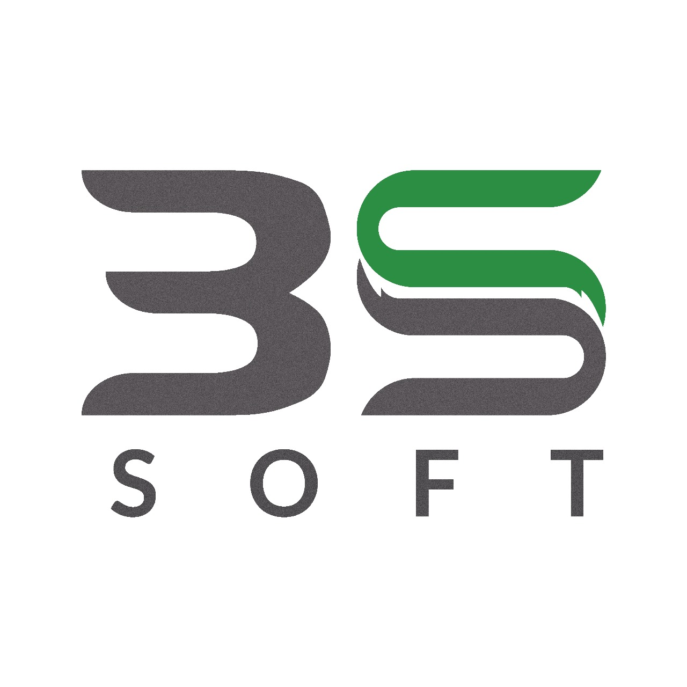

# 3s-Soft

A modern web application built with React and Vite, featuring a modular architecture, team profiles, and essential business pages.

## Table of Contents

- [Overview](#overview)
- [Features](#features)
- [Screenshots](#screenshots)
- [Getting Started](#getting-started)
- [Project Structure](#project-structure)
- [Available Scripts](#available-scripts)
- [Contributing](#contributing)
- [License](#license)
- [Team](#team)

## Overview

3s-Soft is a responsive web app designed to showcase services, team members, testimonials, and company information. Built with React, Vite, and ESLint for fast development and code quality.

## Features

- Fast and lightweight React app powered by Vite
- Modular component structure
- Team profile section
- Services and testimonials pages
- Contact form
- Cookie Policy, Privacy Policy, Terms of Service
- Error handling (404 page)
- Responsive design

## Screenshots



## Getting Started

### Prerequisites

- Node.js (v18+ recommended)
- npm

### Installation

```bash
npm install
```

### Running Locally

```bash
npm run dev
```

Open [http://localhost:5173](http://localhost:5173) in your browser.

### Building for Production

```bash
npm run build
```

## Project Structure

```
├── public/
│   ├── favicon/
│   ├── team-profile/
├── src/
│   ├── assets/
│   ├── Components/
│   ├── data/
│   ├── Layout/
│   ├── Pages/
│   ├── Router/
│   ├── index.css
│   └── main.jsx
├── package.json
├── vite.config.js
├── eslint.config.js
└── README.md
```

## Available Scripts

- `npm run dev` — Start development server
- `npm run build` — Build for production
- `npm run lint` — Run ESLint

## Contributing

Contributions are welcome! Please fork the repository and submit a pull request.

## License

This project is licensed under the MIT License.

## Team

Images and profiles are available in `public/team-profile/`.

- Borhan Siddque
- Fariya
- Jashedul Islam Shaun
- Maptahul Taraq
- Maptaul Islam Taraq
- Mehedi Hasan Akash
- Oahidul Islam Sajib
- Rakibul Hasan
- Shamim

For inquiries, contact the team via the Contact page.
